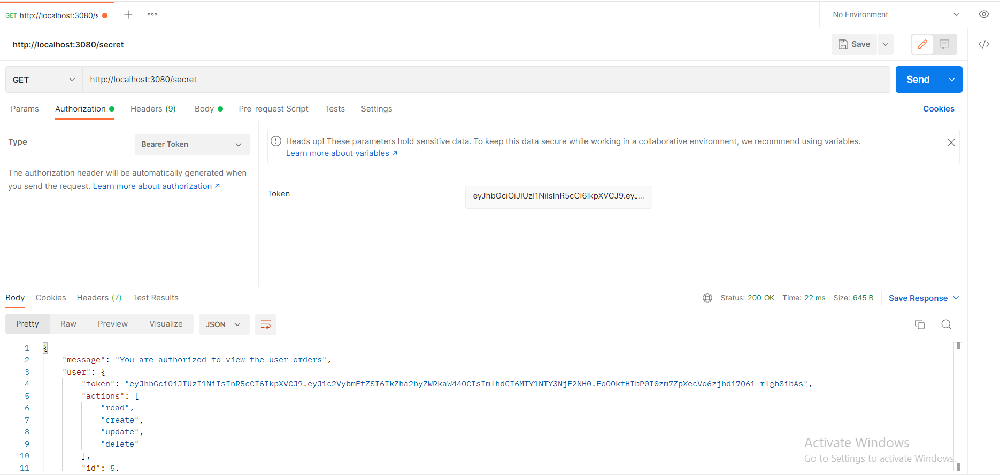
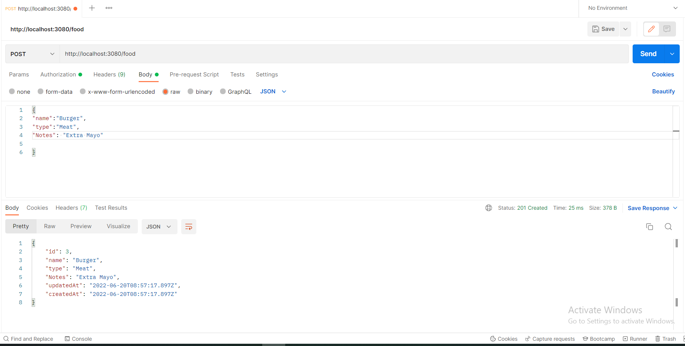
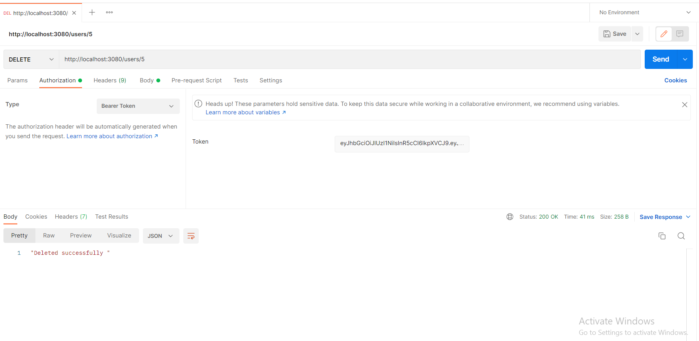
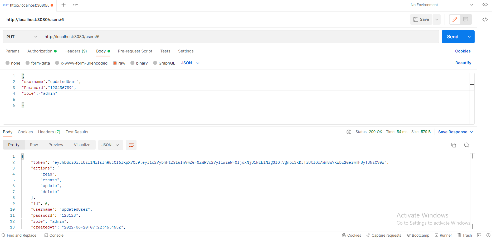

# Fake_resturant

## Overview

A fake resturant were you can add the food you want declaring the Kind and type and you can also specify a note on your order, which you can also get the list of ingredients in your order such as  the main ingredients and the used spices.

The user should create an account and get authorized to place the order

* [Heroku_Link](https://auth-api-fakhreddin.herokuapp.com/)
* [Pull rewquests](https://github.com/h4mz411y/auth_api/pulls?q=is%3Apr+is%3Aclosed)
* [Actions](https://github.com/h4mz411y/auth_api/actions)

## Server_tests

* 
* 
* 
* 
* 
* 
* 
* 
* 
* 
* 
* 

